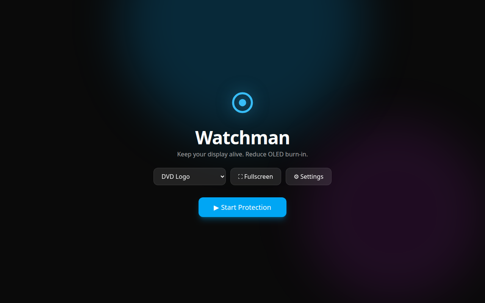
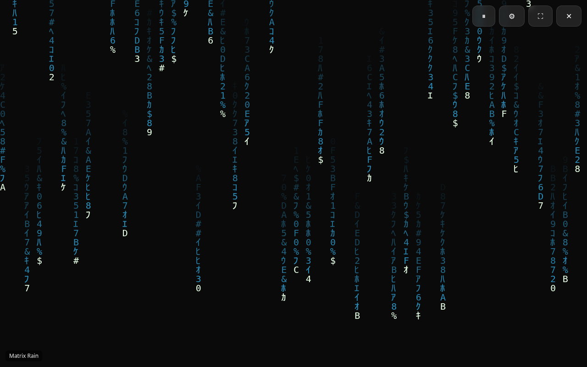

# Watchman

<p align="center">
  <strong>English</strong> · <a href="README.pt-BR.md">Português (Brasil)</a>
</p>

<p align="center">
  
</p>

<p align="center">
  <a href="https://hub.docker.com/r/diaszano/watchman">
    
    
    
  </a>
  <a href="https://github.com/diaszano/watchman/pkgs/container/watchman">
    
  </a>
</p>

An interactive, browser-based screensaver that keeps your display visually active to help reduce the risk of **OLED burn-in** — while looking good doing it. Fully written in TypeScript.

Ten animation modes, live-tunable settings, an anti burn-in engine, playlists, PWA/offline support, and one-command Docker deployment.

---

## Features

- **10 animation modes** — DVD Logo, Digital Clock, Particle System, Floating Bubbles, Starfield (parallax), Matrix Rain, Neon Lines, Geometric Shapes, Custom Logo (image upload), Custom Text.
- **Anti burn-in engine** — global drift and per-mode motion so nothing sits static.
- **Live configuration** — speed, object count, size, colors, background (solid / gradient / image), opacity, brightness, FPS cap. Every control updates in real time.
- **Per-animation relevant controls** — each mode only surfaces the settings that affect it.
- **Automatic playlist** — pick favorites, set a switch interval, sequential or random.
- **Screen Wake Lock API** — keeps the display awake while protection runs; auto-reacquires; degrades gracefully with a notice when unsupported.
- **Fullscreen API**, **keyboard shortcuts**, **auto-hiding UI**, and an optional **FPS monitor**.
- **In-app keyboard shortcut overlay** — press `H` at any time to see every shortcut.
- **Persistent preferences** — settings are saved to LocalStorage, while uploaded images stay in IndexedDB.
- **Light / dark themes** — the light theme is fully functional — and **English / Português** i18n.
- **Accessible settings dialog** — native dialog semantics and keyboard focus management.
- **PWA** — installable, offline-capable via service worker.
- **High-DPI / 4K / ultrawide** aware (DPR-scaled canvas, capped for performance).

## Rendering

The canvas follows the display's device pixel ratio, capped at 2 for predictable performance on high-resolution screens. Use the FPS limit setting (30, 60, 120, or unlimited) to balance smoothness and power use. Uploaded background and logo images stay in this browser through IndexedDB and are limited to 5 MiB each.

## Screenshots

| Home                   | Player                     |
| ---------------------- | -------------------------- |
|  |  |

## Keyboard shortcuts

| Key       | Action                   |
| --------- | ------------------------ |
| `F`       | Toggle fullscreen        |
| `Space`   | Pause / resume           |
| `Esc`     | Exit fullscreen          |
| `S`       | Toggle settings          |
| `N`       | Next animation           |
| `P`       | Previous animation       |
| `H` / `?` | Toggle shortcuts overlay |

`Esc` also closes the settings panel when it is open.

## Tech stack

TypeScript · React 19 · Vite · Tailwind CSS v4 · Zustand · Vitest · ESLint · Prettier · Docker · Nginx.

---

## Installation

Requires Node.js 24 (run `nvm use` when nvm is installed).

```bash
npm ci
```

Use `npm install` only when intentionally changing dependencies, because it updates `package-lock.json`.

### Development

```bash
npm run dev        # Vite dev server (HMR) at http://localhost:5173
```

### Other scripts

```bash
npm run build      # type-check + production build to dist/
npm run preview    # preview the production build
npm run lint       # ESLint
npm run format     # Prettier
npm run format:check # verify Prettier formatting without modifying files
npm test           # Vitest
npm run test:watch # Vitest watch mode
npm run test:commits # validate local commit messages
npm run test:release # validate the release configuration
```

## Contributing

Commit messages and pull request titles follow [Conventional Commits](https://www.conventionalcommits.org/):

```text
feat: add a new capability
fix(canvas): correct rendering behavior
chore(ci): maintain automation
```

`npm ci` configures the Husky `commit-msg` hook. The same rules are checked against every pull request commit in CI.

See [CONTRIBUTING.md](CONTRIBUTING.md) for the development workflow, branch policy, and pull request checklist.

---

## Docker

Run the hardened production image locally:

```bash
docker compose up --build      # http://localhost:8080
```

Run the Vite development server with HMR inside a container:

```bash
docker compose --profile dev up --build   # http://localhost:5173
```

Both Compose services bind to `127.0.0.1` by default, so they are not exposed
to other devices on the network. Add an explicit reverse proxy or change the
host binding when remote access is intentional.

## Production deployment

`Dockerfile` uses a reproducible multi-stage build: Node.js 24 LTS compiles the
static bundle, then NGINX 1.30.3 Alpine Slim serves only `dist/`. The runtime
runs as the non-root `nginx` user on port 8080, provides `/health`, uses a
read-only root filesystem under Compose, and sends baseline browser security
headers. `nginx.conf` also handles compression, immutable caching for
fingerprinted assets, SPA fallback, and revalidation for the application shell
and PWA metadata.

Base image tags are pinned to immutable digests in `Dockerfile` and
`Dockerfile.dev`. When updating a digest, rebuild the image and run the local
container verification and Trivy scan before publishing it.

### Docker Hub publication

Every successful push to `main` publishes stable multi-architecture images for `linux/amd64` and `linux/arm64` to Docker Hub and GHCR with the `latest` tag. When the commits produce a semantic release, the images also receive `X.Y.Z`, `X.Y`, and `X` tags.

Pushes to `dev` publish the moving `dev` tag to both registries. Commits that qualify for a semantic release also publish an exact prerelease tag such as `X.Y.Z-dev.N`.

Conventional Commits determine the next version: `fix`, `perf`, and `revert` create a patch; `feat` creates a minor; and a breaking change creates a major. The release workflow creates the Git tag and publishes the GitHub Release automatically.

Repository administrators must create these GitHub Actions secrets:

| Secret               | Purpose                                                 |
| -------------------- | ------------------------------------------------------- |
| `DOCKERHUB_USERNAME` | Docker Hub account or organization that owns `watchman` |
| `DOCKERHUB_TOKEN`    | Docker Hub access token with push permission            |

Before the first publication, create the Docker Hub repository `watchman` under the account or organization named by `DOCKERHUB_USERNAME`.

The repository must allow GitHub Actions to write repository contents so Semantic Release can create tags and GitHub Releases.

When protecting `main`, require the `Commit messages`, `Lint, test, and build`, and `Pull request title` checks.

---

## Architecture

The render pipeline is intentionally **canvas-first and React-light**: React owns the shell (routing, settings UI, overlays, and background); a single `requestAnimationFrame` loop drives animation pixels.

- `useAnimationLoop` reads settings via `zustand`'s `getState()` **each frame**, so tuning is instant without React re-renders. It handles DPR sizing, the FPS cap, tab-visibility pause, and the anti burn-in drift — in one place, so every animation benefits.
- Each **animation is an independent module** exposing a factory `() => { draw(frame) }`. State lives in the closure and resets on switch. Adding one requires a new module and a registry entry in `animations/index.ts`.
- **Navigation** uses the browser's native hash routing, keeping the two-page flow dependency-free.
- **Settings** are one strongly-typed store persisted to LocalStorage via `zustand/middleware`; uploaded images are stored separately in IndexedDB.

### Folder structure

```text
src/
 ├── animations/   # one module per mode + registry + playlist logic
 ├── components/   # reusable UI (Button, controls, SettingsPanel, canvas…)
 ├── hooks/        # animation loop, wake lock, fullscreen, keyboard, images, i18n
 ├── pages/        # HomePage, PlayerPage
 ├── services/     # i18n dictionary and browser image storage
 ├── stores/       # settingsStore (zustand + persist)
 ├── styles/       # Tailwind entry
 ├── types/        # shared types (Settings, Animation, AnimationFrame)
 ├── utils/        # math and color helpers
 └── App.tsx
```

---

## License

MIT
