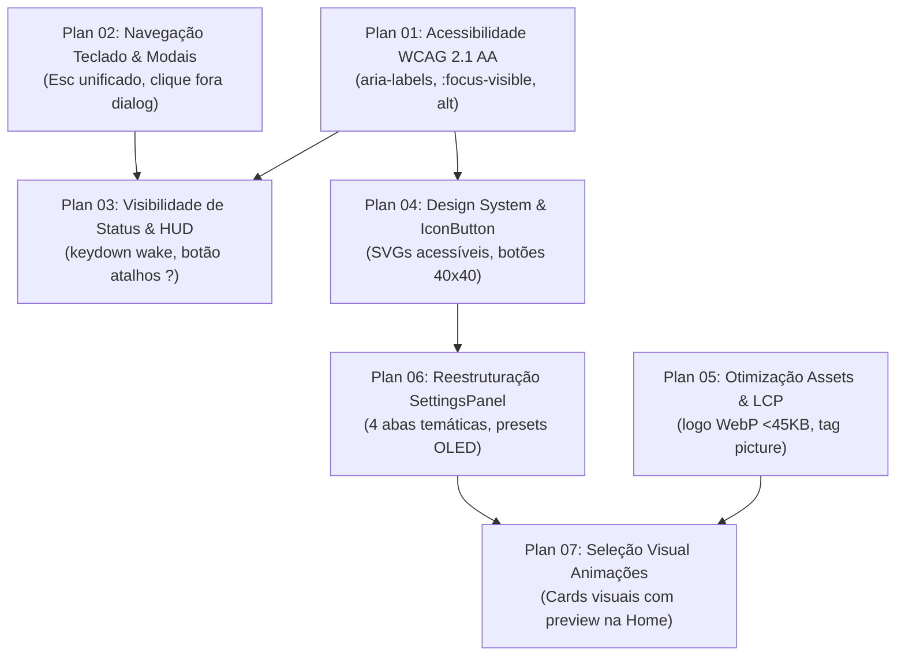

# Índice de Planos de Implementação de UI/UX — Watchman

> **For agentic workers:** REQUIRED SUB-SKILL: Use superpowers:subagent-driven-development (recommended) or superpowers:executing-plans to implement this roadmap task-by-task.

Este documento consolida e orquestra os 7 planos de melhoria de UI, UX e Acessibilidade gerados a partir da avaliação heurística do **Watchman**.

---

## 🗺️ Mapa de Execução e Dependências

---

## 📋 Lista Geral de Planos

| # | Plano | Prioridade | Arquivo | Status |
| :-: | :--- | :-: | :--- | :-: |
| 1 | **Acessibilidade WCAG 2.1 AA** | 🔴 P0 | [`2026-09-26-ui-ux-01-acessibilidade-wcag.md`](2026-09-26-ui-ux-01-acessibilidade-wcag.md) | ✅ Concluído |
| 2 | **Navegação por Teclado e Modais** | 🔴 P0 | [`2026-09-26-ui-ux-02-navegacao-teclado-modais.md`](2026-09-26-ui-ux-02-navegacao-teclado-modais.md) | ✅ Concluído |
| 3 | **Visibilidade de Status e HUD** | 🟡 P1 | [`2026-09-26-ui-ux-03-visibilidade-status-hud.md`](2026-09-26-ui-ux-03-visibilidade-status-hud.md) | ✅ Concluído |
| 4 | **Design System de Ícones & IconButton** | 🟡 P1 | [`2026-09-26-ui-ux-04-design-system-icon-buttons.md`](2026-09-26-ui-ux-04-design-system-icon-buttons.md) | ✅ Concluído |
| 5 | **Otimização de Assets e LCP (WebP)** | 🟡 P1 | [`2026-09-26-ui-ux-05-otimizacao-assets-lcp.md`](2026-09-26-ui-ux-05-otimizacao-assets-lcp.md) | ✅ Concluído |
| 6 | **Reestruturação do SettingsPanel em Abas** | 🟢 P2 | [`2026-09-26-ui-ux-06-reestruturacao-settings-panel.md`](2026-09-26-ui-ux-06-reestruturacao-settings-panel.md) | ✅ Concluído |
| 7 | **Seleção Visual de Animações na Home** | 🟢 P2 | [`2026-09-26-ui-ux-07-selecao-visual-animacoes.md`](2026-09-26-ui-ux-07-selecao-visual-animacoes.md) | ✅ Concluído |

---

## Execução

Os planos 1 e 2 foram concluídos anteriormente. Os planos 3 a 7 foram implementados na branch `feat/ui-ux-improvements`, com testes, typecheck e build de produção.
